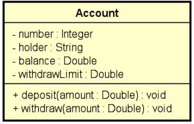

# Udemy - Java Completo 2023 - Conta Bancária Java

Esta é uma solução criada para o Exercício de Fixação do curso Java Orientado a Objetos, que tem como objetivo aprimorar minhas habilidades de programação e design de soluções.

## Índice

- [Visão geral](#overview)
  - [Descrição](#descricao)
  - [Captura de tela](#screenshot)
  - [Links](#links)
- [Meu processo](processo #my)
  - [Construído com](#built-com)
- [Autor](#author)

## Overview

### Descrição

O programa consiste em uma classe Account que representa uma conta bancária com um número, titular, saldo e limite de saque. A classe possui métodos para depositar e sacar dinheiro, e a lógica de negócios é implementada em validationWithdraw para garantir que a quantia de saque não exceda o limite de saque e que haja saldo suficiente. Se ocorrer algum erro de negócio, será lançada uma exceção BusinessExceptions.

O programa possui uma classe Program que lê os dados da conta a partir da entrada do usuário usando a classe Scanner, cria uma instância de Account e chama o método withdraw para sacar a quantia informada pelo usuário. Se ocorrer uma exceção BusinessExceptions, a mensagem de erro é exibida na tela. Caso contrário, o novo saldo da conta é exibido na tela.

### Captura de tela

### Links

- Solution URL: [Add solution URL here](https://github.com/FelipeMT21/exceptions1-java)

## Meu processo

### Construído com

- Programação Orientada a Objetos (POO) em Java
- Tratamento de exceções
- Classes e objetos em Java
- Encapsulamento de dados
- Entrada e saída de dados com a classe Scanner
- Manipulação de strings com o método String.format()

## Autor

- Website - [João Felipe - Development Software](https://felipemt21.github.io/curriculo/)
- Mentor Frontend - [@FelipeMT21](https://www.frontendmentor.io/profile/FelipeMT21)
- Linkedin - [João Felipe](https://www.linkedin.com/in/jo%C3%A3o-felipe-1028aa210/)
- GitHub - [FelipeMT21](https://github.com/FelipeMT21)